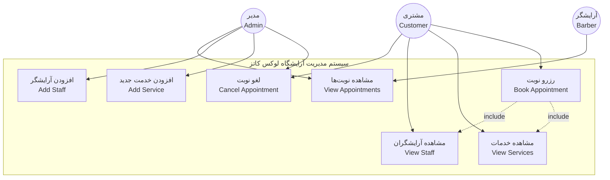
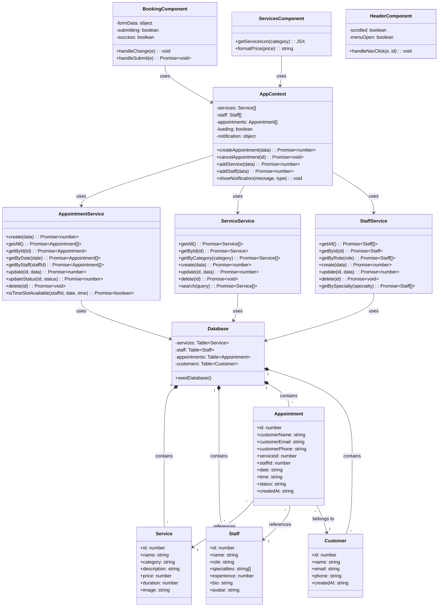
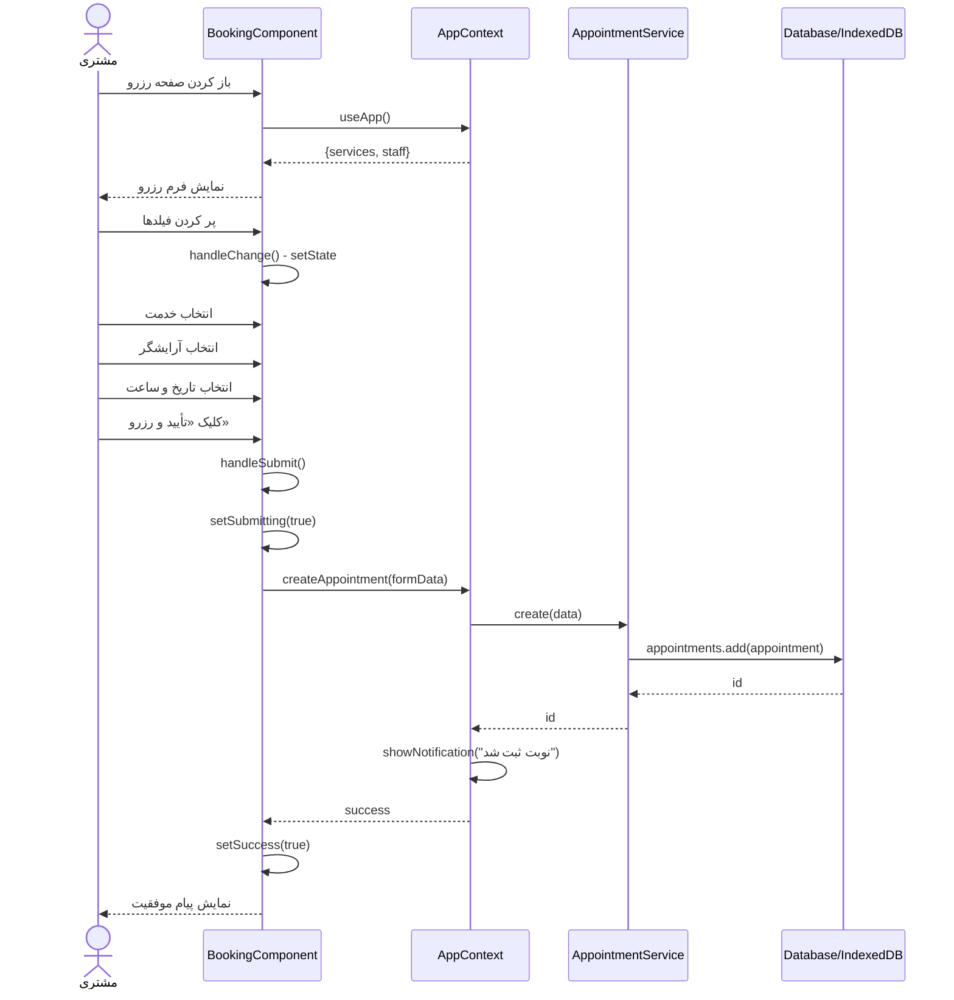
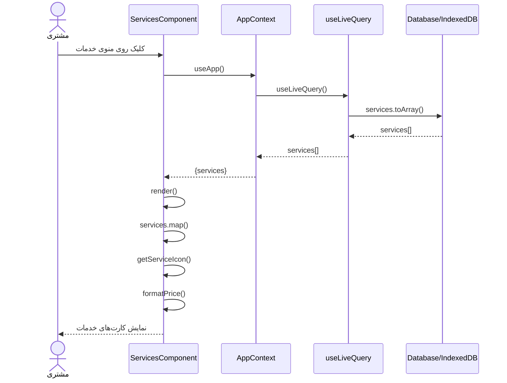
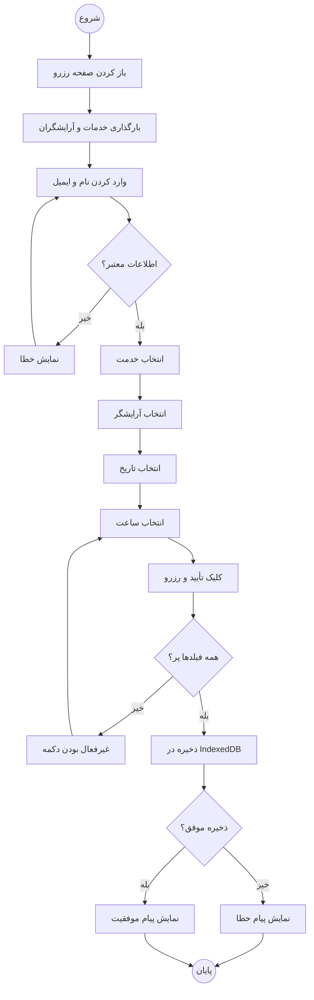
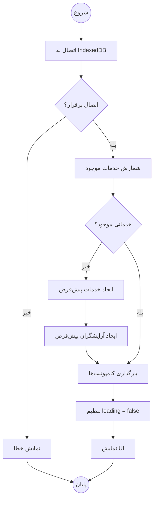
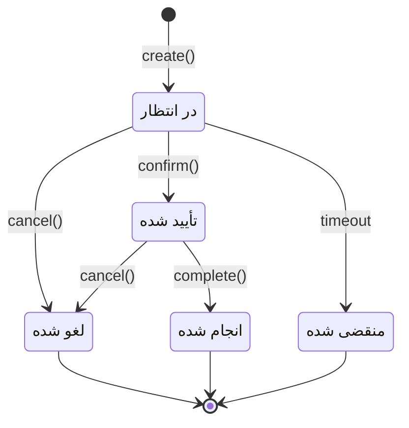
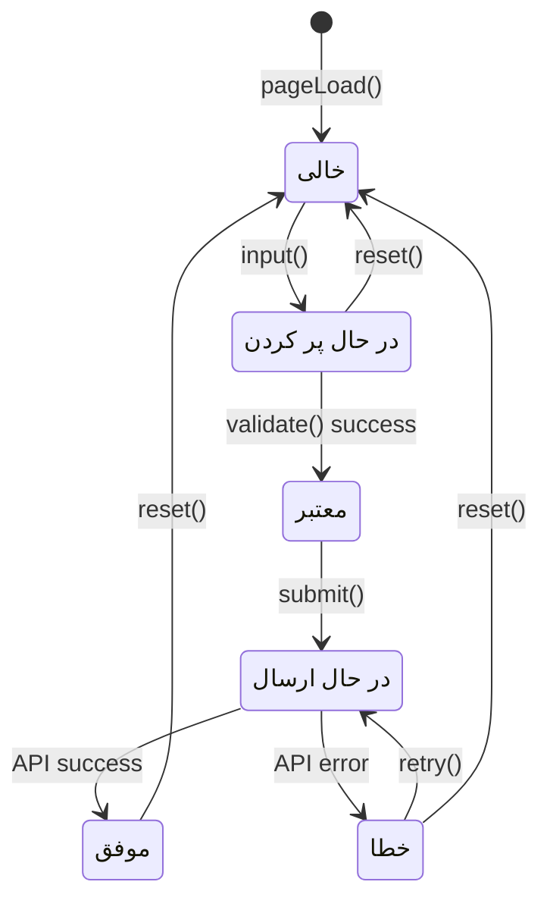

# نمودارهای UML - فرمت Mermaid

این فایل شامل نمودارهای UML به فرمت Mermaid است که می‌توانید در Visual Paradigm یا ابزارهای دیگر استفاده کنید.

---

## ۱. نمودار Use Case

---

## ۲. نمودار Class

---

## ۳. نمودار Sequence - رزرو نوبت

---

## ۴. نمودار Sequence - مشاهده خدمات

---

## ۵. نمودار Activity - رزرو نوبت

---

## ۶. نمودار Activity - بارگذاری داده‌های اولیه

---

## ۷. نمودار State - وضعیت نوبت

---

## ۸. نمودار State - وضعیت فرم رزرو

---

## نحوه استفاده در Visual Paradigm

برای استفاده از این نمودارها در Visual Paradigm:

1. **Use Case Diagram**: از منوی Diagram > New > Use Case Diagram استفاده کنید
2. **Class Diagram**: از منوی Diagram > New > Class Diagram استفاده کنید  
3. **Sequence Diagram**: از منوی Diagram > New > Sequence Diagram استفاده کنید
4. **Activity Diagram**: از منوی Diagram > New > Activity Diagram استفاده کنید
5. **State Machine Diagram**: از منوی Diagram > New > State Machine Diagram استفاده کنید

### تبدیل Mermaid به تصویر:
- از وب‌سایت [mermaid.live](https://mermaid.live) استفاده کنید
- کد را paste کرده و تصویر PNG/SVG را دانلود کنید
